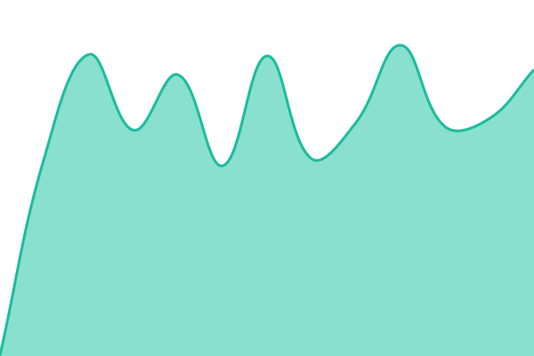
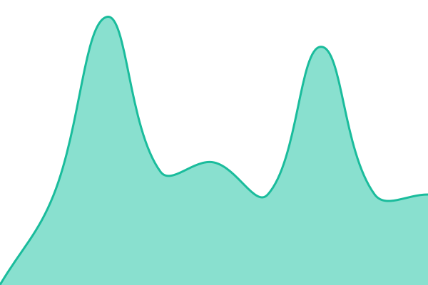
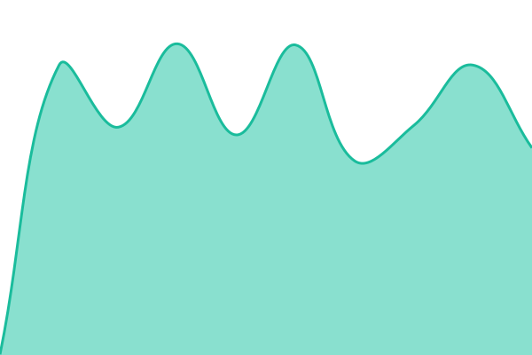

# État des services 2gather

**État courant : <!--live status--> **🟩 All systems operational\*\*

Ce dépôt mesure la disponibilité des services 2gather. Les points d'entrée sont interrogés toutes
les cinq minutes depuis les runners GitHub Actions, donc depuis l'extérieur de l'infrastructure
surveillée. Chaque mesure est ajoutée à l'historique du dépôt, jamais réécrite.

[Page de statut](https://2gather-nyxus.github.io/upptime/) ·
[Historique des relevés](https://github.com/2gather-nyxus/upptime/commits/main)

## Ce qui est surveillé

| Service                         | Ce que la sonde vérifie                               |
| ------------------------------- | ----------------------------------------------------- |
| API                             | le processus répond, sans toucher la base ni le cache |
| API, accès base de données      | une lecture aboutit réellement en base                |
| Application web événements      | la page répond                                        |
| Application web profils         | la page répond                                        |
| Administration (trois consoles) | la console répond                                     |

**Deux sondes portent sur l'API, et c'est délibéré.** La première répond un statut constant sans
interroger la base : elle reste verte quand PostgreSQL est tombé. La seconde lit réellement en base,
bornée à un seul enregistrement. Les deux ensemble distinguent un processus mort d'une base morte.
Sur l'une comme sur l'autre le contenu de la réponse est vérifié, donc un code 200 qui rendrait un
corps vide compte comme indisponible.

**Seules les adresses sans enjeu sont publiées.** La sonde de vie de l'API et les deux applications
web sont affichées en clair : elles ne rendent rien qu'un visiteur ne puisse déjà voir. La sonde de
lecture en base et les trois consoles d'administration passent par des secrets de dépôt, référencés
par leur nom dans la configuration. Leur état est public, leur adresse ne l'est pas. Upptime écrit
le nom du secret dans `history/`, jamais sa valeur, et n'affiche aucun lien pour ces services.

**Les applications mobiles ne figurent pas ici.** Elles ne s'interrogent pas en HTTP et dépendent de
l'API ci-dessus. Leur taux de sessions sans plantage se mesure avec un outil distinct.

## Comment lire les états

- 🟩 **Up** : la sonde répond, dans le budget de temps de réponse.
- 🟨 **Degraded** : la sonde répond mais dépasse `maxResponseTime`, soit 2 s pour l'API et 3 s pour
  les interfaces web. Ces seuils valent environ quatre fois la latence observée en régime normal.
- 🟥 **Down** : la sonde ne répond pas, renvoie un code d'erreur, ou rend un corps qui ne contient
  pas le marqueur attendu.

Une interruption ouvre une issue datée, assignée, close au rétablissement. `skipDeleteIssues` est
activé : sans ce réglage Upptime supprime les issues refermées en moins de quinze minutes, ce qui
efface justement les incidents courts, les plus fréquents.

<!--start: status pages-->
<!-- This summary is generated by Upptime (https://github.com/upptime/upptime) -->
<!-- Do not edit this manually, your changes will be overwritten -->
<!-- prettier-ignore -->
| URL | Status | History | Response Time | Uptime |
| --- | ------ | ------- | ------------- | ------ |
|  [API](https://api.2-gather.app/api/health) | 🟩 Up | [api.yml](https://github.com/2gather-nyxus/upptime/commits/HEAD/history/api.yml) | 

 492ms
     
 | 

<a href="https://2gather-nyxus.github.io/upptime/history/api">100.00%</a>
    

|  API, acces base de donnees | 🟩 Up | [api-acces-base-de-donnees.yml](https://github.com/2gather-nyxus/upptime/commits/HEAD/history/api-acces-base-de-donnees.yml) | 

 591ms
     
 | 

<a href="https://2gather-nyxus.github.io/upptime/history/api-acces-base-de-donnees">0.00%</a>
    

|  [Application web evenements](https://2gather.events) | 🟩 Up | [application-web-evenements.yml](https://github.com/2gather-nyxus/upptime/commits/HEAD/history/application-web-evenements.yml) | 

 847ms
     
 | 

<a href="https://2gather-nyxus.github.io/upptime/history/application-web-evenements">100.00%</a>
    

|  [Application web profils](https://2gather.me) | 🟩 Up | [application-web-profils.yml](https://github.com/2gather-nyxus/upptime/commits/HEAD/history/application-web-profils.yml) | 

 754ms
     
 | 

<a href="https://2gather-nyxus.github.io/upptime/history/application-web-profils">100.00%</a>
    

|  Administration, production | 🟩 Up | [administration-production.yml](https://github.com/2gather-nyxus/upptime/commits/HEAD/history/administration-production.yml) | 

 490ms
     
 | 

<a href="https://2gather-nyxus.github.io/upptime/history/administration-production">0.00%</a>
    

|  Administration, evenements | 🟩 Up | [administration-evenements.yml](https://github.com/2gather-nyxus/upptime/commits/HEAD/history/administration-evenements.yml) | 

 1605ms
     
 | 

<a href="https://2gather-nyxus.github.io/upptime/history/administration-evenements">0.00%</a>
    

|  Administration, profils | 🟩 Up | [administration-profils.yml](https://github.com/2gather-nyxus/upptime/commits/HEAD/history/administration-profils.yml) | 

 566ms
     
 | 

<a href="https://2gather-nyxus.github.io/upptime/history/administration-profils">0.00%</a>
    

<!--end: status pages-->

[Voir la page de statut](https://2gather-nyxus.github.io/upptime/)

## Exploitation

Cinq workflows tournent seuls : `Uptime CI` toutes les cinq minutes, puis `Response Time CI`,
`Graphs CI`, `Static Site CI` et `Summary CI` qui reconstruisent des vues à partir de l'historique.
Le dépôt est public, donc les minutes GitHub Actions ne sont pas décomptées du quota.

`Update Template CI` et `Updates CI` ne sont pas planifiés, ils se déclenchent à la main. Ces deux
tâches réécrivent des fichiers de workflow, ce que le jeton natif des Actions n'a pas le droit de
faire, quelle que soit la permission accordée au dépôt. Les lancer suppose un jeton personnel
à portée fine, stocké en secret `GH_PAT`, avec droit d'écriture sur Contents, Workflows et Issues.
Sans ce jeton elles échouent, et c'est pourquoi elles ne sont pas planifiées : un échec quotidien
dans un dépôt d'état est un mauvais signal.

### Secrets attendus

| Secret             | Rôle                                           |
| ------------------ | ---------------------------------------------- |
| `API_EVENTS_URL`   | sonde de lecture en base, bornée à un résultat |
| `ADMIN_APP_URL`    | console d'administration production            |
| `ADMIN_EVENTS_URL` | console d'administration événements            |
| `ADMIN_ME_URL`     | console d'administration profils               |

Tout nouveau secret doit être ajouté à la liste `secrets` de `.upptimerc.yml`. Cette liste est la
liste blanche complète : un secret absent n'est pas transmis aux workflows.

### Alertes

Une interruption assigne une issue, ce qui déclenche la notification GitHub habituelle par courriel.
Pour une alerte temps réel, Upptime accepte Slack, Discord, Telegram et le webhook générique. Il faut
poser les secrets du fournisseur, par exemple `NOTIFICATION_SLACK` à `true` et
`NOTIFICATION_SLACK_WEBHOOK_URL`, puis ajouter ces deux noms à la liste `secrets`.

### Fenêtre de maintenance

Ouvrir une issue depuis le modèle _Maintenance Event_ et renseigner `start`, `end` et `expectedDown`
dans le commentaire du haut. La période est alors exclue du calcul de disponibilité.

## Licences

- Outil : [Upptime](https://github.com/upptime/upptime), licence MIT.
- Code : [MIT](./LICENSE), Anand Chowdhary.
- Données du répertoire `./history` :
  [Open Database License](https://opendatacommons.org/licenses/odbl/summary/).
